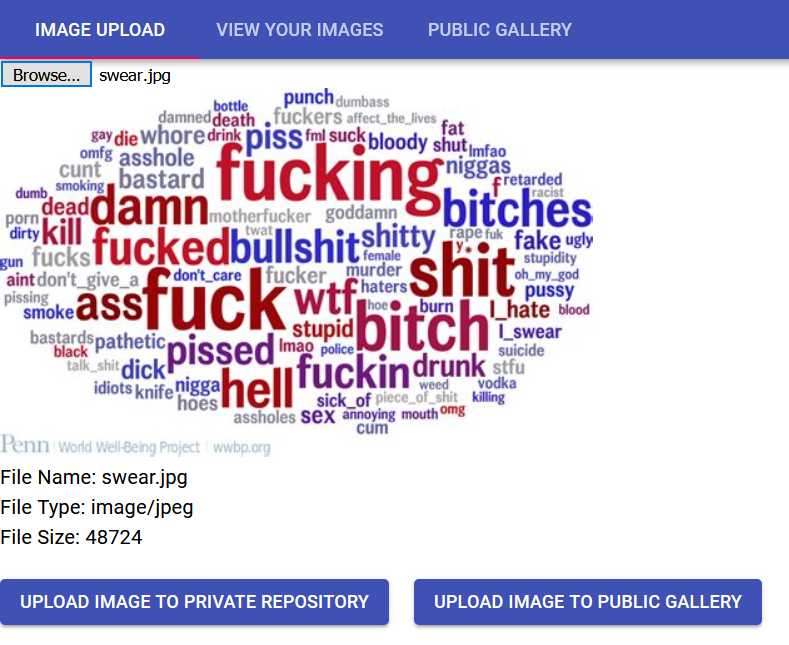
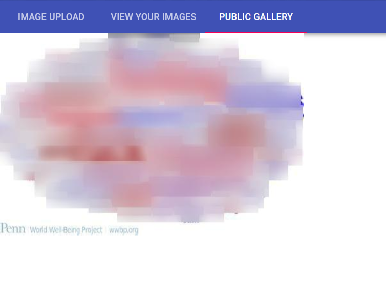
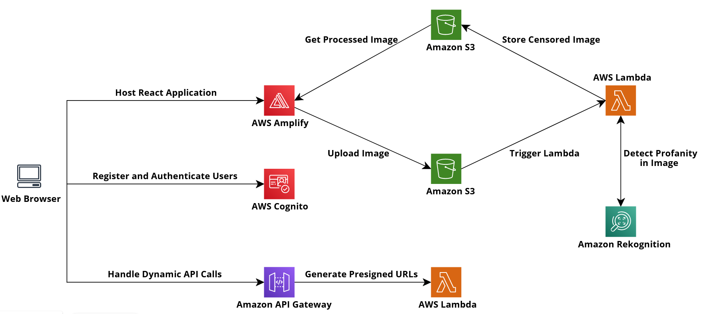

# Image Content Moderation
An image repository featuring the detection of inappropriate text using Amazon Rekognition [Link to Demo](https://main.d28fod3nlo4xoq.amplifyapp.com)
<p>
    
    
</p>

# Deployment Instructions
In order to deploy the application you must have an AWS account and the following tools setup
- AWS CLI (https://docs.aws.amazon.com/cli/latest/userguide/install-cliv2.html)
- SAM CLI (https://docs.aws.amazon.com/serverless-application-model/latest/developerguide/serverless-sam-cli-install.html)
- Docker (https://docs.docker.com/get-docker/)

1. Login to AWS ECR public repository
```
aws ecr-public get-login-password --region us-east-1 | docker login --username AWS --password-stdin public.ecr.aws
```
or if you have configured the AWS CLI with a custom profile run
```
aws ecr-public get-login-password --region us-east-1 --profile=<AWS CLI profile> | docker login --username AWS --password-stdin public.ecr.aws
```

2. Create Lambda container images
```
cd lambdas
sam build
```

3. Provision the AWS resources
```
sam deploy --template-file .aws-sam/build/template.yaml --stack-name image-content-moderator --image-repository <AWS ECR Repository URI> --region <AWS region> --profile <AWS CLI profile> --capabilities CAPABILITY_IAM --parameter-overrides ClientUri=http://localhost:3000
```
If you do not have a private AWS ECR repository check out https://docs.aws.amazon.com/AmazonECR/latest/userguide/docker-push-ecr-image.html

4. Configure the client
Switch to the client folder and create a .env file
```
cd ../client
```
```
type nul >> ".env"
```
or
```
touch .env
```
Inside the .env file add the following parameters and fill in their values
```
REACT_APP_SERVICE_URI=""
REACT_APP_REGION=""
REACT_APP_USER_POOL_ID=""
REACT_APP_USER_POOL_CLIENT_ID=""
```
- The service uri can be viewed in the ouputs of step 3 or by going to the Api Gateway service on the AWS console
- The pool id and pool client id can be found in the cognito service on the AWS console

5. Start the client
```
npm install
npm start
```

# Testing Instructions
1. Create a virtual environment and activate it (below is windows command)
```
python -m venv venv
venv\scripts\activate
```

2. Go to the unit tests directory and run the unit tests
```
cd tests/unit
python -m unittest
```

# Platform Architecture
<p align="center">
    
</p>
